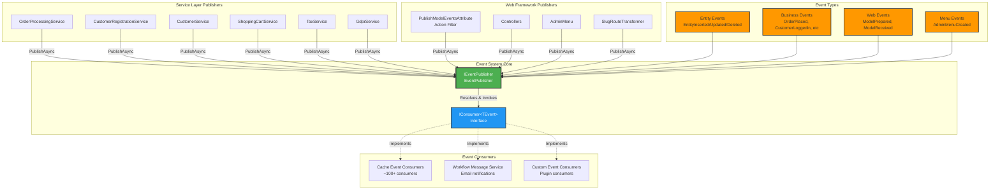
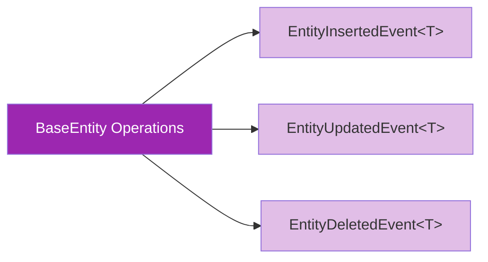
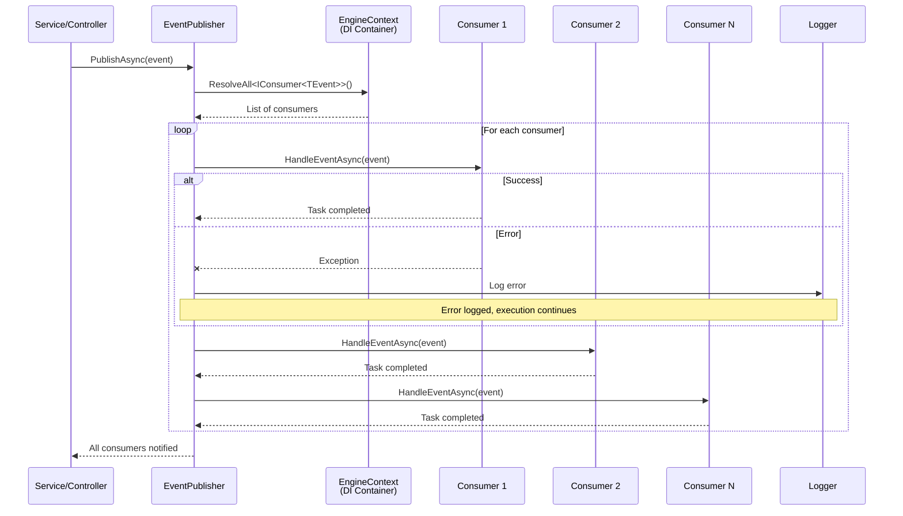
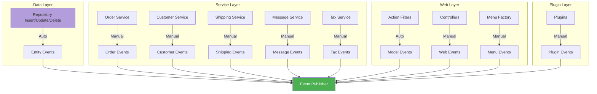
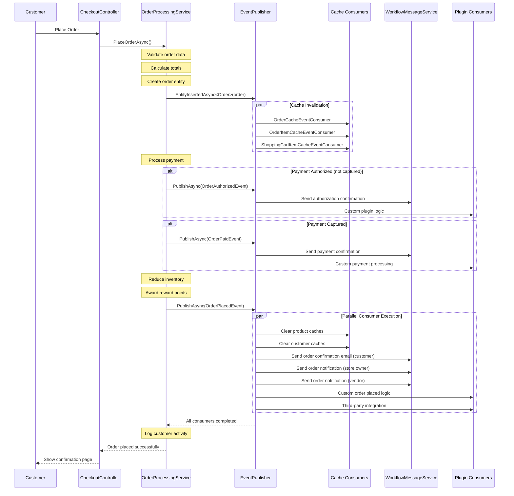
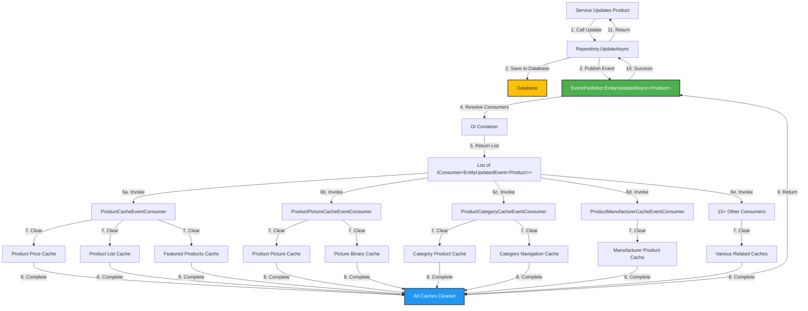
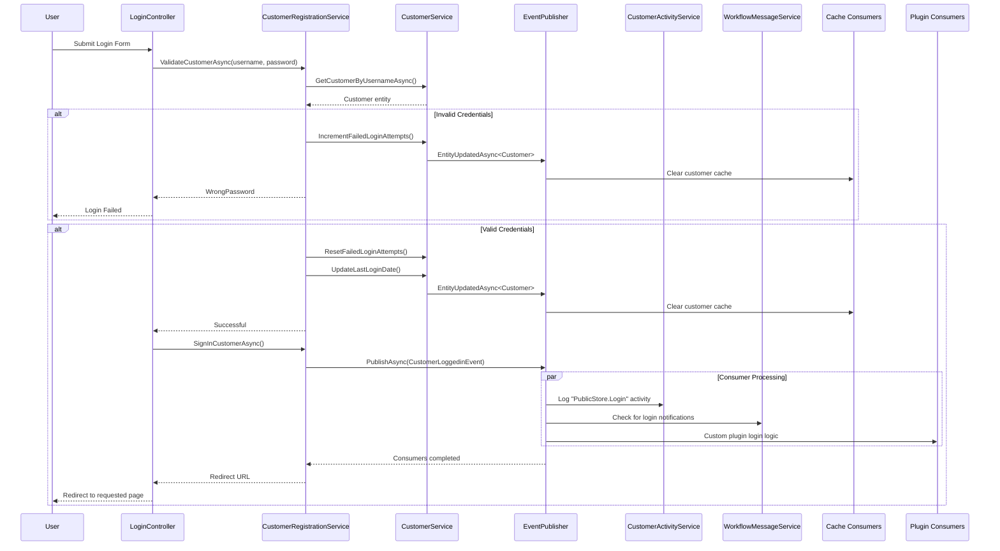
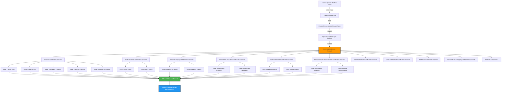

# NopCommerce Event System Architecture

**Technical Report**
**Date:** 2025-10-13
**Version:** NopCommerce 4.8
**Author:** System Architecture Analysis

---

## Executive Summary

This report provides a comprehensive analysis of the NopCommerce event system architecture, documenting the publish-subscribe pattern implementation that enables loose coupling and extensibility throughout the platform. The event system serves as the backbone for cache invalidation, workflow automation, plugin integration, and cross-cutting concerns across the entire application.

**Key Findings:**
- 100+ cache event consumers automatically maintain cache consistency
- 50+ domain-specific business events for order processing, customer management, and shipping
- Automatic event discovery via dependency injection eliminates manual wiring
- Error isolation prevents consumer failures from cascading
- Extensible architecture allows plugins to integrate seamlessly

---

## Table of Contents

1. [System Overview](#system-overview)
2. [Core Architecture](#core-architecture)
3. [Event Types & Hierarchy](#event-types--hierarchy)
4. [Event Consumer Types](#event-consumer-types)
5. [Event Publishing & Subscription Mechanisms](#event-publishing--subscription-mechanisms)
6. [Flow Diagrams](#flow-diagrams)
7. [Implementation Examples](#implementation-examples)
8. [Benefits & Design Principles](#benefits--design-principles)
9. [Extension Points](#extension-points)
10. [Codebase Reference Map](#codebase-reference-map)

---

## System Overview

NopCommerce implements a **publish-subscribe (pub/sub) event system** that enables various components to react to domain events without direct dependencies. The architecture follows these principles:

- **Event-Driven Architecture (EDA)** - Components communicate through events rather than direct method calls
- **Inversion of Control** - Event publishers don't know about consumers
- **Dependency Injection** - Automatic consumer discovery and registration
- **Error Isolation** - Consumer failures are logged but don't affect other consumers
- **Extensibility** - Plugins can subscribe to any event without modifying core code

### System Components

| Component | Purpose | Location |
|-----------|---------|----------|
| **IEventPublisher** | Interface for publishing events | `Libraries\Nop.Core\Events\IEventPublisher.cs:6` |
| **EventPublisher** | Concrete implementation | `Libraries\Nop.Services\Events\EventPublisher.cs:10` |
| **IConsumer&lt;T&gt;** | Interface for event consumers | `Libraries\Nop.Services\Events\IConsumer.cs:7` |
| **Event Classes** | Strongly-typed event data | `Libraries\Nop.Core\Domain\{Domain}\` |
| **Cache Consumers** | Automatic cache invalidation | `Libraries\Nop.Services\{Domain}\Caching\` |

---

## Core Architecture

### Architectural Diagram



### Core Component Descriptions

#### 1. IEventPublisher Interface

**Location:** `Libraries\Nop.Core\Events\IEventPublisher.cs`

The primary interface for publishing events throughout the application.

**Methods:**
```csharp
Task PublishAsync<TEvent>(TEvent @event);  // Asynchronous publication
void Publish<TEvent>(TEvent @event);       // Synchronous publication
```

**Responsibility:** Defines the contract for broadcasting events to registered consumers.

#### 2. EventPublisher Implementation

**Location:** `Libraries\Nop.Services\Events\EventPublisher.cs:10`

The concrete implementation that handles event distribution.

**Key Features:**
- Resolves all `IConsumer<TEvent>` instances via dependency injection
- Invokes consumers sequentially
- Includes comprehensive error handling
- Logs consumer exceptions without breaking the event flow
- Supports both synchronous and asynchronous publication

**Implementation Highlights:**
```csharp
public virtual async Task PublishAsync<TEvent>(TEvent @event)
{
    // Get all registered consumers for this event type
    var consumers = EngineContext.Current.ResolveAll<IConsumer<TEvent>>().ToList();

    foreach (var consumer in consumers)
    {
        try
        {
            await consumer.HandleEventAsync(@event);
        }
        catch (Exception exception)
        {
            // Log error without breaking execution
            var logger = EngineContext.Current.Resolve<ILogger>();
            await logger.ErrorAsync(exception.Message, exception);
        }
    }
}
```

#### 3. IConsumer&lt;T&gt; Interface

**Location:** `Libraries\Nop.Services\Events\IConsumer.cs:7`

All event consumers must implement this interface.

**Contract:**
```csharp
public partial interface IConsumer<T>
{
    Task HandleEventAsync(T eventMessage);
}
```

**Usage:** Classes implementing this interface are automatically discovered and registered by the dependency injection container.

---

## Event Types & Hierarchy

### Event Classification

Events in NopCommerce are organized into three primary categories:

1. **Entity Events** - Generic events for CRUD operations
2. **Domain-Specific Business Events** - Specialized events for business processes
3. **Web Framework Events** - Events related to web application lifecycle

### 1. Entity Events (Generic)

Base entity events are automatically triggered by repository operations on any entity inheriting from `BaseEntity`.



**Event Classes:**
- `EntityInsertedEvent<T>` - Published after entity creation
- `EntityUpdatedEvent<T>` - Published after entity modification
- `EntityDeletedEvent<T>` - Published after entity deletion

**Extension Methods** (`Libraries\Nop.Core\Events\EventPublisherExtensions.cs`):
```csharp
Task EntityInsertedAsync<T>(T entity) where T : BaseEntity
Task EntityUpdatedAsync<T>(T entity) where T : BaseEntity
Task EntityDeletedAsync<T>(T entity) where T : BaseEntity
```

**Trigger Mechanism:** Automatically invoked by repository base classes during data persistence operations.

### 2. Domain-Specific Business Events

#### Customer Domain Events

**Location:** `Libraries\Nop.Core\Domain\Customers\`

| Event Class | Trigger Point | Purpose |
|-------------|---------------|---------|
| `CustomerLoggedinEvent` | `CustomerRegistrationService.cs:449` | User successfully authenticated |
| `CustomerLoggedOutEvent` | Authentication logout | User session terminated |
| `CustomerRegisteredEvent` | User registration completion | New user account created |
| `CustomerActivatedEvent` | Account activation | User account enabled |
| `CustomerPasswordChangedEvent` | `CustomerRegistrationService.cs:414` | Password update successful |
| `CustomerChangeWorkingLanguageEvent` | Language preference change | User language updated |
| `CustomerChangeMultiFactorAuthenticationProviderEvent` | MFA provider change | Security settings modified |

#### Order Domain Events

**Location:** `Libraries\Nop.Core\Domain\Orders\`

| Event Class | Trigger Point(s) | Purpose |
|-------------|------------------|---------|
| `OrderPlacedEvent` | `OrderProcessingService.cs:1581, 1950` | New order created |
| `OrderPaidEvent` | `OrderProcessingService.cs:1090` | Payment successfully processed |
| `OrderAuthorizedEvent` | `OrderProcessingService.cs:2382` | Payment authorized but not captured |
| `OrderRefundedEvent` | `OrderProcessingService.cs:2594, 2690, 2781, 2880` | Full or partial refund processed |
| `OrderVoidedEvent` | `OrderProcessingService.cs:2953, 3027` | Order payment voided |
| `OrderStatusChangedEvent` | `OrderProcessingService.cs:1006` | Order status updated |
| `ClearShoppingCartEvent` | Shopping cart clearing | Cart items removed |
| `ResetCheckoutDataEvent` | Checkout reset | Checkout session cleared |

#### Shipping Domain Events

**Location:** `Libraries\Nop.Core\Domain\Shipping\`

| Event Class | Purpose |
|-------------|---------|
| `ShipmentCreatedEvent` | New shipment record created |
| `ShipmentSentEvent` | Shipment dispatched to carrier |
| `ShipmentReadyForPickupEvent` | Shipment available for customer pickup |
| `ShipmentDeliveredEvent` | Shipment successfully delivered |
| `ShipmentTrackingNumberSetEvent` | Tracking number assigned |
| `ShipmentStatusEvent` | Generic shipment status change |

#### Catalog Domain Events

**Location:** `Libraries\Nop.Core\Domain\Catalog\Events.cs`

| Event Class | Purpose |
|-------------|---------|
| `ProductReviewApprovedEvent` | Product review moderated and approved |

#### Blog & News Domain Events

**Location:** `Libraries\Nop.Core\Domain\Blogs\` and `Libraries\Nop.Core\Domain\News\`

| Event Class | Purpose |
|-------------|---------|
| `BlogCommentApprovedEvent` | Blog comment moderated and approved |
| `NewsCommentApprovedEvent` | News comment moderated and approved |

#### Message Domain Events

**Location:** `Libraries\Nop.Core\Domain\Messages\`

| Event Class | Purpose |
|-------------|---------|
| `EmailSubscribedEvent` | Newsletter subscription created |
| `EmailUnsubscribedEvent` | Newsletter subscription cancelled |
| `MessageTokensAddedEvent<U>` | Message template tokens added |
| `EntityTokensAddedEvent<T, U>` | Entity-specific tokens added |
| `AdditionalTokensAddedEvent` | Additional message tokens added |
| `CampaignAdditionalTokensAddedEvent` | Campaign-specific tokens added |

#### Tax Domain Events

**Location:** `Libraries\Nop.Services\Tax\Events\`

| Event Class | Trigger Point | Purpose |
|-------------|---------------|---------|
| `TaxRateCalculatedEvent` | Tax calculation | Individual tax rate computed |
| `TaxTotalCalculatedEvent` | Total tax calculation | Complete tax amount determined |

#### Security Domain Events

**Location:** `Libraries\Nop.Core\Domain\Security\`

| Event Class | Purpose |
|-------------|---------|
| `SecuritySettingsChangedEvent` | Security configuration modified |

#### GDPR Domain Events

**Location:** `Libraries\Nop.Core\Domain\Gdpr\`

Events related to GDPR compliance and data privacy operations.

#### Plugin System Events

**Location:** `Libraries\Nop.Services\Plugins\`

| Event Class | Purpose |
|-------------|---------|
| `PluginsUploadedEvent` | Plugin package uploaded |
| `PluginUpdatedEvent` | Plugin updated to new version |

#### Theme Events

**Location:** `Libraries\Nop.Services\Themes\Events.cs`

| Event Class | Purpose |
|-------------|---------|
| `ThemeChangeEvent` | Store theme changed |

### 3. Web Framework Events

**Location:** `Presentation\Nop.Web.Framework\Events\`

| Event Class | Trigger Mechanism | Purpose |
|-------------|-------------------|---------|
| `ModelPreparedEvent<T>` | `PublishModelEventsAttribute` after action | Model prepared for view rendering |
| `ModelReceivedEvent<T>` | `PublishModelEventsAttribute` before action (POST) | Model received from client |
| `PageRenderingEvent` | Page rendering pipeline | Page about to render |
| `AdminMenuCreatedEvent` | Admin menu construction | Admin navigation menu built |
| `ThirdPartyPluginsMenuItemCreatedEvent` | Plugin menu item creation | Plugin menu item added |
| `ProductSearchEvent` | Product search execution | Search query performed |
| `GenericRoutingEvent` | Route resolution | URL routing processed |

**Additional Web Events:**

**Location:** `Presentation\Nop.Web\Models\`

| Event Class | Purpose |
|-------------|---------|
| `SitemapCreatedEvent` | XML sitemap generated |
| `JsonLdCreatedEvent` | JSON-LD structured data created |

---

## Event Consumer Types

### 1. Cache Event Consumers

**Base Class:** `CacheEventConsumer<TEntity>` (`Libraries\Nop.Services\Caching\CacheEventConsumer.cs:13`)

Cache event consumers are the most numerous consumers in the system (~100+ implementations). They automatically invalidate cached data when entities change.

#### Base Implementation

```csharp
public abstract partial class CacheEventConsumer<TEntity> :
    IConsumer<EntityInsertedEvent<TEntity>>,
    IConsumer<EntityUpdatedEvent<TEntity>>,
    IConsumer<EntityDeletedEvent<TEntity>>
    where TEntity : BaseEntity
{
    protected virtual async Task ClearCacheAsync(TEntity entity, EntityEventType entityEventType)
    {
        // Clear generic entity caches
        await RemoveByPrefixAsync(NopEntityCacheDefaults<TEntity>.ByIdsPrefix);
        await RemoveByPrefixAsync(NopEntityCacheDefaults<TEntity>.AllPrefix);

        if (entityEventType != EntityEventType.Insert)
            await RemoveAsync(NopEntityCacheDefaults<TEntity>.ByIdCacheKey, entity);

        // Derived classes override for specific cache clearing
        await ClearCacheAsync(entity);
    }
}
```

#### Consumer Categories

**Catalog Consumers** (~35 consumers):
- `ProductCacheEventConsumer`
- `CategoryCacheEventConsumer`
- `ManufacturerCacheEventConsumer`
- `ProductAttributeCacheEventConsumer`
- `ProductPictureCacheEventConsumer`
- `ProductCategoryCacheEventConsumer`
- `ProductManufacturerCacheEventConsumer`
- `SpecificationAttributeCacheEventConsumer`
- `TierPriceCacheEventConsumer`
- And 26 more...

**Order Consumers** (~10 consumers):
- `OrderCacheEventConsumer`
- `OrderItemCacheEventConsumer`
- `ShoppingCartItemCacheEventConsumer`
- `GiftCardCacheEventConsumer`
- `CheckoutAttributeCacheEventConsumer`
- `ReturnRequestCacheEventConsumer`
- And 4 more...

**Customer Consumers** (~10 consumers):
- `CustomerCacheEventConsumer`
- `CustomerRoleCacheEventConsumer`
- `CustomerAddressMappingCacheEventConsumer`
- `CustomerAttributeCacheEventConsumer`
- `RewardPointsHistoryCacheEventConsumer`
- And 5 more...

**Shipping Consumers** (~7 consumers):
- `ShipmentCacheEventConsumer`
- `ShippingMethodCacheEventConsumer`
- `WarehouseCacheEventConsumer`
- `DeliveryDateCacheEventConsumer`
- And 3 more...

**Common Consumers** (~5 consumers):
- `AddressCacheEventConsumer`
- `GenericAttributeCacheEventConsumer`
- `SearchTermCacheEventConsumer`
- And 2 more...

**Additional Domain Consumers** (~33 consumers):
- Localization (3 consumers)
- Messages (5 consumers)
- Security (3 consumers)
- Directory (5 consumers)
- Discounts (6 consumers)
- Media (3 consumers)
- Vendors (4 consumers)
- And 4 more domains...

#### Example: ProductCacheEventConsumer

**Location:** `Libraries\Nop.Services\Catalog\Caching\ProductCacheEventConsumer.cs`

```csharp
public partial class ProductCacheEventConsumer : CacheEventConsumer<Product>
{
    protected override async Task ClearCacheAsync(Product entity, EntityEventType entityEventType)
    {
        // Clear product-specific caches
        await RemoveByPrefixAsync(NopCatalogDefaults.ProductManufacturersByProductPrefix, entity);
        await RemoveAsync(NopCatalogDefaults.ProductsHomepageCacheKey);
        await RemoveByPrefixAsync(NopCatalogDefaults.ProductPricePrefix, entity);
        await RemoveByPrefixAsync(NopCatalogDefaults.ProductMultiplePricePrefix, entity);
        await RemoveByPrefixAsync(NopEntityCacheDefaults<ShoppingCartItem>.AllPrefix);
        await RemoveByPrefixAsync(NopCatalogDefaults.FeaturedProductIdsPrefix);

        if (entityEventType == EntityEventType.Delete)
        {
            // Additional clearing on delete
            await RemoveByPrefixAsync(NopCatalogDefaults.FilterableSpecificationAttributeOptionsPrefix);
            await RemoveByPrefixAsync(NopCatalogDefaults.ManufacturersByCategoryPrefix);
        }

        await RemoveAsync(NopDiscountDefaults.AppliedDiscountsCacheKey, nameof(Product), entity);

        // Call base implementation
        await base.ClearCacheAsync(entity, entityEventType);
    }
}
```

**Naming Convention:** `{Entity}CacheEventConsumer.cs`

### 2. Workflow Message Consumers

**Service:** `WorkflowMessageService` (`Libraries\Nop.Services\Messages\WorkflowMessageService.cs`)

This service implements multiple consumers to send automated emails based on business events.

**Email Triggers:**

| Event | Email Sent |
|-------|------------|
| `OrderPlacedEvent` | Order confirmation to customer |
| `OrderPlacedEvent` | Order notification to store owner |
| `OrderPlacedEvent` | Vendor order notification |
| `OrderPaidEvent` | Payment received confirmation |
| `OrderRefundedEvent` | Refund processed notification |
| `ShipmentSentEvent` | Shipment tracking information |
| `ShipmentDeliveredEvent` | Delivery confirmation |
| `CustomerRegisteredEvent` | Welcome email |
| `CustomerPasswordChangedEvent` | Password change confirmation |
| `ProductReviewApprovedEvent` | Review approved notification |
| `NewsLetterSubscriptionEvent` | Subscription confirmation |

### 3. Custom Plugin Consumers

Plugins can implement `IConsumer<TEvent>` to react to system events without modifying core code.

**Examples Found in Codebase:**

**WZ.Plugin.Widgets.StoreDrop**
- **Location:** `Plugins\WZ.Plugin.Widgets.StoreDrop\Events.cs`
- Custom event handling for store drop functionality

**WZ.Plugin.Misc.OrderSubmit**
- **Location:** `Plugins\WZ.Plugin.Misc.OrderSubmit\Events.cs`
- Custom order submission workflow

**WZ.Plugin.Widget.SavedCart**
- **Location:** `Plugins\WZ.Plugin.Widget.SavedCart\Events.cs`
- Saved cart event handling

**Nop.Plugin.Misc.WebApi.Framework**
- **Location:** `Plugins\Nop.Plugin.Misc.WebApi.Framework\Services\EventConsumer.cs`
- Web API event integration

**Nop.Plugin.ExternalAuth.Office**
- **Location:** `Plugins\Nop.Plugin.ExternalAuth.Office\Events.cs`
- Office 365 authentication events

### 4. Business Logic Consumers

**CustomerEventConsumer** (`Libraries\Nop.Services\Customers\CustomerEventConsumer.cs`)

Implements business rules triggered by customer events, such as:
- Customer role management
- Activity logging
- Customer statistics updates

---

## Event Publishing & Subscription Mechanisms

### Publishing Flow Diagram



### Subscription Mechanism

**Automatic Registration via Dependency Injection**

1. **Consumer Implementation**
   - Developer creates class implementing `IConsumer<TEvent>`
   - No explicit registration required

2. **Automatic Discovery**
   - NopCommerce's DI container scans assemblies at startup
   - All `IConsumer<T>` implementations are registered automatically

3. **Event Publication**
   - Publisher calls `_eventPublisher.PublishAsync(event)`
   - EventPublisher uses `EngineContext.Current.ResolveAll<IConsumer<TEvent>>()`
   - All registered consumers are invoked sequentially

4. **Consumer Invocation**
   - Each consumer's `HandleEventAsync` method is called
   - Errors are caught and logged without affecting other consumers

**No Manual Wiring Required:**
- No configuration files
- No attribute decoration
- No explicit subscription calls
- Just implement the interface

### Event Triggering Points



#### Automatic Event Triggers

**1. Entity Changes** - Repository Operations

All repository operations automatically publish entity events:

```csharp
// In repository base class
public async Task InsertAsync(TEntity entity)
{
    await _entities.InsertOneAsync(entity);
    await _eventPublisher.EntityInsertedAsync(entity);  // Automatic
}

public async Task UpdateAsync(TEntity entity)
{
    await _entities.ReplaceOneAsync(e => e.Id == entity.Id, entity);
    await _eventPublisher.EntityUpdatedAsync(entity);  // Automatic
}

public async Task DeleteAsync(TEntity entity)
{
    await _entities.DeleteOneAsync(e => e.Id == entity.Id);
    await _eventPublisher.EntityDeletedAsync(entity);  // Automatic
}
```

**2. Model Binding** - Via `PublishModelEventsAttribute`

The `PublishModelEventsAttribute` action filter is applied globally to controllers.

**Location:** `Presentation\Nop.Web.Framework\Mvc\Filters\PublishModelEventsAttribute.cs`

**Automatic Event Publication:**
- `ModelReceivedEvent<T>` - Published BEFORE action execution (POST requests only)
- `ModelPreparedEvent<T>` - Published AFTER action execution, before result

**Implementation:**
```csharp
[PublishModelEvents]  // Applied globally
public class ProductController : BasePublicController
{
    public async Task<IActionResult> ProductDetails(int productId)
    {
        // ModelReceivedEvent published here automatically (if POST)

        var model = await PrepareProductModel(productId);

        // ModelPreparedEvent published here automatically

        return View(model);
    }
}
```

**3. Admin Menu Construction** - Via `BaseAdminMenuCreatedEventConsumer`

Published automatically when the admin navigation menu is built.

**Location:** `Presentation\Nop.Web.Framework\Events\BaseAdminMenuCreatedEventConsumer.cs`

#### Manual Event Triggers

Services explicitly call `_eventPublisher.PublishAsync(new EventType(...))` at strategic points.

**Order Processing Service** - `Libraries\Nop.Services\Orders\OrderProcessingService.cs`

| Line | Event | Context |
|------|-------|---------|
| 1006 | `OrderStatusChangedEvent` | Order status updated |
| 1090 | `OrderPaidEvent` | Payment successfully captured |
| 1581 | `OrderPlacedEvent` | New order created (guest checkout) |
| 1950 | `OrderPlacedEvent` | New order created (registered user) |
| 2382 | `OrderAuthorizedEvent` | Payment authorized |
| 2594 | `OrderRefundedEvent` | Refund via payment method |
| 2690 | `OrderRefundedEvent` | Offline refund |
| 2781 | `OrderRefundedEvent` | Partial refund |
| 2880 | `OrderRefundedEvent` | Refund completion |
| 2953 | `OrderVoidedEvent` | Payment void via payment method |
| 3027 | `OrderVoidedEvent` | Offline void |

**Customer Registration Service** - `Libraries\Nop.Services\Customers\CustomerRegistrationService.cs`

| Line | Event | Context |
|------|-------|---------|
| 414 | `CustomerPasswordChangedEvent` | Password successfully changed |
| 449 | `CustomerLoggedinEvent` | User successfully authenticated |

**Customer Service** - `Libraries\Nop.Services\Customers\CustomerService.cs`

Publishes entity events via repository operations:
- Customer insert/update/delete
- Customer role mapping changes
- Address mapping changes

---

## Flow Diagrams

### Complete Order Placement Flow



### Cache Invalidation Flow



### Customer Authentication Flow



### Product Update Cache Cascade



---

## Implementation Examples

### Example 1: Creating a Custom Event

#### Step 1: Define the Event Class

**File:** `Plugins\MyPlugin\Events\CustomOrderProcessedEvent.cs`

```csharp
namespace MyPlugin.Events
{
    /// <summary>
    /// Event published when custom order processing completes
    /// </summary>
    public class CustomOrderProcessedEvent
    {
        /// <summary>
        /// Constructor
        /// </summary>
        /// <param name="order">The processed order</param>
        /// <param name="customData">Custom processing data</param>
        public CustomOrderProcessedEvent(Order order, string customData)
        {
            Order = order;
            CustomData = customData;
        }

        /// <summary>
        /// Gets the order
        /// </summary>
        public Order Order { get; }

        /// <summary>
        /// Gets custom processing data
        /// </summary>
        public string CustomData { get; }
    }
}
```

#### Step 2: Implement Event Consumer

**File:** `Plugins\MyPlugin\Consumers\CustomOrderProcessedEventConsumer.cs`

```csharp
using Nop.Services.Events;
using Nop.Services.Logging;

namespace MyPlugin.Consumers
{
    /// <summary>
    /// Consumer for custom order processed events
    /// </summary>
    public class CustomOrderProcessedEventConsumer : IConsumer<CustomOrderProcessedEvent>
    {
        private readonly ILogger _logger;
        private readonly ICustomerActivityService _customerActivityService;

        public CustomOrderProcessedEventConsumer(
            ILogger logger,
            ICustomerActivityService customerActivityService)
        {
            _logger = logger;
            _customerActivityService = customerActivityService;
        }

        /// <summary>
        /// Handle the event
        /// </summary>
        /// <param name="eventMessage">Event data</param>
        public async Task HandleEventAsync(CustomOrderProcessedEvent eventMessage)
        {
            var order = eventMessage.Order;

            // Log activity
            await _customerActivityService.InsertActivityAsync(
                order.CustomerId,
                "CustomOrderProcessed",
                $"Custom order processing completed: {eventMessage.CustomData}",
                order);

            // Additional custom logic
            await _logger.InformationAsync(
                $"Order {order.Id} processed with custom data: {eventMessage.CustomData}");
        }
    }
}
```

#### Step 3: Publish the Event

**File:** `Plugins\MyPlugin\Services\MyOrderProcessingService.cs`

```csharp
using Nop.Core.Events;

namespace MyPlugin.Services
{
    public class MyOrderProcessingService
    {
        private readonly IEventPublisher _eventPublisher;

        public MyOrderProcessingService(IEventPublisher eventPublisher)
        {
            _eventPublisher = eventPublisher;
        }

        public async Task ProcessOrderAsync(Order order)
        {
            // Custom order processing logic
            var customData = "Processed with special handling";

            // ... business logic ...

            // Publish the event
            await _eventPublisher.PublishAsync(
                new CustomOrderProcessedEvent(order, customData));
        }
    }
}
```

### Example 2: Subscribing to Existing Events

#### Scenario: Send SMS Notification on Order Placement

**File:** `Plugins\SmsNotification\Consumers\OrderPlacedEventConsumer.cs`

```csharp
using Nop.Core.Domain.Orders;
using Nop.Services.Events;

namespace SmsNotification.Consumers
{
    public class OrderPlacedEventConsumer : IConsumer<OrderPlacedEvent>
    {
        private readonly ISmsService _smsService;
        private readonly ICustomerService _customerService;

        public OrderPlacedEventConsumer(
            ISmsService smsService,
            ICustomerService customerService)
        {
            _smsService = smsService;
            _customerService = customerService;
        }

        public async Task HandleEventAsync(OrderPlacedEvent eventMessage)
        {
            var order = eventMessage.Order;
            var customer = await _customerService.GetCustomerByIdAsync(order.CustomerId);

            if (customer?.Phone != null)
            {
                var message = $"Your order #{order.CustomOrderNumber} has been placed successfully. " +
                              $"Total: {order.OrderTotal:C}";

                await _smsService.SendSmsAsync(customer.Phone, message);
            }
        }
    }
}
```

### Example 3: Cache Event Consumer

#### Scenario: Custom Entity with Automatic Cache Clearing

**File:** `Plugins\CustomModule\Caching\CustomEntityCacheEventConsumer.cs`

```csharp
using Nop.Services.Caching;
using CustomModule.Domain;

namespace CustomModule.Caching
{
    /// <summary>
    /// Cache event consumer for custom entity
    /// </summary>
    public partial class CustomEntityCacheEventConsumer : CacheEventConsumer<CustomEntity>
    {
        /// <summary>
        /// Clear cache data
        /// </summary>
        /// <param name="entity">Entity</param>
        /// <param name="entityEventType">Entity event type</param>
        protected override async Task ClearCacheAsync(
            CustomEntity entity,
            EntityEventType entityEventType)
        {
            // Clear custom entity caches
            await RemoveByPrefixAsync(CustomEntityDefaults.CustomEntityPrefix);
            await RemoveByPrefixAsync(CustomEntityDefaults.CustomEntityByTypePrefix, entity.TypeId);

            // Clear related caches
            await RemoveAsync(CustomEntityDefaults.CustomEntityDetailsKey, entity.Id);

            // If entity is deleted, clear additional caches
            if (entityEventType == EntityEventType.Delete)
            {
                await RemoveByPrefixAsync(CustomEntityDefaults.CustomEntitySearchPrefix);
            }

            // Call base implementation to clear standard entity caches
            await base.ClearCacheAsync(entity, entityEventType);
        }
    }
}
```

### Example 4: Multiple Event Consumer

#### Scenario: Activity Logger for Multiple Events

**File:** `Plugins\ActivityTracker\Consumers\CustomerActivityEventConsumer.cs`

```csharp
using Nop.Core.Domain.Customers;
using Nop.Services.Events;
using Nop.Services.Logging;

namespace ActivityTracker.Consumers
{
    /// <summary>
    /// Tracks customer activities across multiple events
    /// </summary>
    public class CustomerActivityEventConsumer :
        IConsumer<CustomerLoggedinEvent>,
        IConsumer<CustomerLoggedOutEvent>,
        IConsumer<CustomerPasswordChangedEvent>,
        IConsumer<CustomerRegisteredEvent>
    {
        private readonly ILogger _logger;
        private readonly ICustomerActivityService _activityService;

        public CustomerActivityEventConsumer(
            ILogger logger,
            ICustomerActivityService activityService)
        {
            _logger = logger;
            _activityService = activityService;
        }

        public async Task HandleEventAsync(CustomerLoggedinEvent eventMessage)
        {
            await _activityService.InsertActivityAsync(
                eventMessage.Customer,
                "PublicStore.Login",
                "Customer logged in");
        }

        public async Task HandleEventAsync(CustomerLoggedOutEvent eventMessage)
        {
            await _activityService.InsertActivityAsync(
                eventMessage.Customer,
                "PublicStore.Logout",
                "Customer logged out");
        }

        public async Task HandleEventAsync(CustomerPasswordChangedEvent eventMessage)
        {
            await _activityService.InsertActivityAsync(
                eventMessage.Password.CustomerId,
                "PublicStore.PasswordChanged",
                "Customer changed password");
        }

        public async Task HandleEventAsync(CustomerRegisteredEvent eventMessage)
        {
            await _activityService.InsertActivityAsync(
                eventMessage.Customer,
                "PublicStore.Register",
                "Customer registered");
        }
    }
}
```

### Example 5: Conditional Event Handling

#### Scenario: Process Orders Above Certain Threshold

**File:** `Plugins\HighValueOrder\Consumers\HighValueOrderConsumer.cs`

```csharp
using Nop.Core.Domain.Orders;
using Nop.Services.Events;
using Nop.Services.Messages;

namespace HighValueOrder.Consumers
{
    public class HighValueOrderConsumer : IConsumer<OrderPlacedEvent>
    {
        private readonly IWorkflowMessageService _workflowMessageService;
        private readonly ILogger _logger;
        private const decimal HIGH_VALUE_THRESHOLD = 1000m;

        public HighValueOrderConsumer(
            IWorkflowMessageService workflowMessageService,
            ILogger logger)
        {
            _workflowMessageService = workflowMessageService;
            _logger = logger;
        }

        public async Task HandleEventAsync(OrderPlacedEvent eventMessage)
        {
            var order = eventMessage.Order;

            // Only process high-value orders
            if (order.OrderTotal < HIGH_VALUE_THRESHOLD)
                return;

            // Send notification to management
            await _workflowMessageService.SendCustomNotificationAsync(
                "management@store.com",
                "High Value Order Placed",
                $"Order #{order.CustomOrderNumber} placed for {order.OrderTotal:C}");

            // Log for audit
            await _logger.InformationAsync(
                $"High value order detected: Order {order.Id}, Total: {order.OrderTotal:C}");

            // Additional high-value order processing...
        }
    }
}
```

---

## Benefits & Design Principles

### Key Benefits

1. **Loose Coupling**
   - Publishers don't know about consumers
   - Consumers don't know about each other
   - Components can be added/removed without affecting others
   - Reduces inter-module dependencies

2. **Single Responsibility Principle**
   - Each consumer handles one specific concern
   - Business logic separated from cross-cutting concerns
   - Clear separation of responsibilities

3. **Open/Closed Principle**
   - System is open for extension (new consumers)
   - System is closed for modification (no core changes needed)
   - New functionality added without modifying existing code

4. **Extensibility**
   - Plugins can subscribe to any event
   - No need to modify core code
   - Third-party integrations easily implemented
   - Custom business logic added without conflicts

5. **Automatic Cache Management**
   - Cache invalidation happens automatically
   - No manual cache clearing needed
   - 100+ consumers maintain cache consistency
   - Prevents stale data issues

6. **Workflow Automation**
   - Emails sent automatically on events
   - No manual triggering needed
   - Consistent notification delivery
   - Reduces boilerplate code

7. **Error Isolation**
   - Failed consumers don't affect others
   - Errors are logged, not propagated
   - System remains stable even with buggy consumers
   - Graceful degradation

8. **Testability**
   - Consumers can be tested in isolation
   - Mock event publishers for testing
   - Unit tests for specific event handling
   - Integration tests for event flows

9. **Maintainability**
   - Clear event flow documentation
   - Easy to understand cause and effect
   - Simple to add new functionality
   - Reduced code complexity

10. **Performance**
    - Asynchronous event handling
    - Non-blocking operations
    - Parallel consumer execution where possible
    - Efficient resource utilization

### Design Principles Applied

#### 1. Event-Driven Architecture (EDA)

The system follows EDA principles:
- **Event Producers** - Services that generate events
- **Event Channel** - EventPublisher and DI container
- **Event Consumers** - Components that react to events
- **Asynchronous Communication** - Non-blocking event processing

#### 2. Dependency Inversion Principle

- High-level modules (services) depend on abstractions (`IEventPublisher`)
- Low-level modules (consumers) depend on abstractions (`IConsumer<T>`)
- Both depend on interfaces, not concrete implementations

#### 3. Interface Segregation Principle

- Small, focused interfaces (`IConsumer<T>` has one method)
- Consumers only implement interfaces for events they care about
- No forced implementation of unused methods

#### 4. Command Query Separation

- Events represent "something that happened" (past tense)
- Events are immutable (read-only properties)
- Consumers react but don't return values
- Clear separation between commands and queries

#### 5. Domain-Driven Design (DDD)

- Events represent domain concepts
- Event names reflect business language
- Events carry domain entity information
- Aligns with ubiquitous language

---

## Extension Points

### How Plugins Can Extend the Event System

#### 1. Subscribe to Existing Events

Plugins can implement `IConsumer<TEvent>` for any existing event:

```csharp
// Subscribe to order events
public class MyOrderConsumer : IConsumer<OrderPlacedEvent>
{
    public async Task HandleEventAsync(OrderPlacedEvent eventMessage)
    {
        // Custom order processing
    }
}

// Subscribe to customer events
public class MyCustomerConsumer : IConsumer<CustomerRegisteredEvent>
{
    public async Task HandleEventAsync(CustomerRegisteredEvent eventMessage)
    {
        // Custom customer processing
    }
}

// Subscribe to product events
public class MyProductConsumer :
    IConsumer<EntityInsertedEvent<Product>>,
    IConsumer<EntityUpdatedEvent<Product>>
{
    public async Task HandleEventAsync(EntityInsertedEvent<Product> eventMessage)
    {
        // Handle new products
    }

    public async Task HandleEventAsync(EntityUpdatedEvent<Product> eventMessage)
    {
        // Handle product updates
    }
}
```

#### 2. Create Custom Events

Plugins can define and publish their own events:

```csharp
// Define custom event
public class SubscriptionExpiredEvent
{
    public Customer Customer { get; set; }
    public DateTime ExpirationDate { get; set; }
}

// Publish custom event
public class SubscriptionService
{
    private readonly IEventPublisher _eventPublisher;

    public async Task CheckExpirationsAsync()
    {
        var expiredCustomers = await GetExpiredCustomersAsync();

        foreach (var customer in expiredCustomers)
        {
            await _eventPublisher.PublishAsync(new SubscriptionExpiredEvent
            {
                Customer = customer,
                ExpirationDate = customer.SubscriptionEndDate
            });
        }
    }
}

// Other plugins can subscribe
public class SubscriptionNotificationConsumer : IConsumer<SubscriptionExpiredEvent>
{
    public async Task HandleEventAsync(SubscriptionExpiredEvent eventMessage)
    {
        // Send expiration notification
    }
}
```

#### 3. Implement Cache Consumers

Plugins with custom entities can implement cache invalidation:

```csharp
public class MyCustomEntityCacheEventConsumer : CacheEventConsumer<MyCustomEntity>
{
    protected override async Task ClearCacheAsync(
        MyCustomEntity entity,
        EntityEventType entityEventType)
    {
        // Clear custom caches
        await RemoveByPrefixAsync("MyPlugin.CustomEntity");
        await base.ClearCacheAsync(entity, entityEventType);
    }
}
```

#### 4. Extend Model Events

Plugins can react to model preparation:

```csharp
public class ProductModelExtensionConsumer : IConsumer<ModelPreparedEvent<ProductDetailsModel>>
{
    public async Task HandleEventAsync(ModelPreparedEvent<ProductDetailsModel> eventMessage)
    {
        var model = eventMessage.Model;

        // Add custom properties or modify existing ones
        model.CustomData = await GetCustomDataAsync(model.Id);
    }
}
```

#### 5. Integrate with External Systems

```csharp
public class ExternalIntegrationConsumer :
    IConsumer<OrderPlacedEvent>,
    IConsumer<OrderPaidEvent>,
    IConsumer<ShipmentSentEvent>
{
    private readonly IExternalApiService _externalApi;

    public async Task HandleEventAsync(OrderPlacedEvent eventMessage)
    {
        // Send order to external system
        await _externalApi.CreateOrderAsync(eventMessage.Order);
    }

    public async Task HandleEventAsync(OrderPaidEvent eventMessage)
    {
        // Update payment status in external system
        await _externalApi.UpdatePaymentStatusAsync(eventMessage.Order);
    }

    public async Task HandleEventAsync(ShipmentSentEvent eventMessage)
    {
        // Send tracking info to external system
        await _externalApi.UpdateShippingStatusAsync(eventMessage.Shipment);
    }
}
```

### Common Extension Scenarios

| Scenario | Events to Subscribe | Purpose |
|----------|-------------------|---------|
| **Email Marketing Integration** | `CustomerRegisteredEvent`, `OrderPlacedEvent` | Sync customers to email platform |
| **Accounting Integration** | `OrderPaidEvent`, `OrderRefundedEvent` | Create invoices and credit notes |
| **Inventory Management** | `OrderPlacedEvent`, `ShipmentSentEvent` | Update external inventory system |
| **CRM Integration** | Customer events, Order events | Sync customer data and activities |
| **Analytics Tracking** | All domain events | Send events to analytics platform |
| **Custom Notifications** | Order events, Shipment events | Send SMS, push notifications |
| **Reward Programs** | `OrderPlacedEvent`, `ProductReviewApprovedEvent` | Award points, track engagement |
| **Fraud Detection** | `OrderPlacedEvent`, `CustomerLoggedinEvent` | Analyze patterns, flag suspicious activity |
| **Webhooks** | Any event | Forward events to external URLs |
| **Audit Logging** | All entity events | Track all data changes |

---

## Codebase Reference Map

### Core Infrastructure

| Component | File Path |
|-----------|-----------|
| `IEventPublisher` | `Libraries\Nop.Core\Events\IEventPublisher.cs` |
| `EventPublisher` | `Libraries\Nop.Services\Events\EventPublisher.cs` |
| `IConsumer<T>` | `Libraries\Nop.Services\Events\IConsumer.cs` |
| `EventPublisherExtensions` | `Libraries\Nop.Core\Events\EventPublisherExtensions.cs` |
| Entity Events | `Libraries\Nop.Core\Events\Entity*Event.cs` |
| `CacheEventConsumer<T>` | `Libraries\Nop.Services\Caching\CacheEventConsumer.cs` |

### Domain Event Definitions

| Domain | File Path |
|--------|-----------|
| **Orders** | `Libraries\Nop.Core\Domain\Orders\*Event.cs` |
| **Customers** | `Libraries\Nop.Core\Domain\Customers\*Event.cs` |
| **Shipping** | `Libraries\Nop.Core\Domain\Shipping\*Event.cs` |
| **Catalog** | `Libraries\Nop.Core\Domain\Catalog\Events.cs` |
| **Messages** | `Libraries\Nop.Core\Domain\Messages\*Event.cs` |
| **Blogs** | `Libraries\Nop.Core\Domain\Blogs\Events.cs` |
| **News** | `Libraries\Nop.Core\Domain\News\Events.cs` |
| **Security** | `Libraries\Nop.Core\Domain\Security\*Event.cs` |
| **GDPR** | `Libraries\Nop.Core\Domain\Gdpr\Events.cs` |

### Web Framework Events

| Component | File Path |
|-----------|-----------|
| `ModelPreparedEvent<T>` | `Presentation\Nop.Web.Framework\Events\ModelPreparedEvent.cs` |
| `ModelReceivedEvent<T>` | `Presentation\Nop.Web.Framework\Events\ModelReceivedEvent.cs` |
| `PublishModelEventsAttribute` | `Presentation\Nop.Web.Framework\Mvc\Filters\PublishModelEventsAttribute.cs` |
| `AdminMenuCreatedEvent` | `Presentation\Nop.Web.Framework\Events\AdminMenuCreatedEvent.cs` |
| `ProductSearchEvent` | `Presentation\Nop.Web.Framework\Events\ProductSearchEvent.cs` |
| `PageRenderingEvent` | `Presentation\Nop.Web.Framework\Events\PageRenderingEvent.cs` |
| `GenericRoutingEvent` | `Presentation\Nop.Web.Framework\Events\GenericRoutingEvent.cs` |
| Web Event Extensions | `Presentation\Nop.Web.Framework\Events\EventPublisherExtensions.cs` |

### Service Layer Publishers

| Service | File Path | Events Published |
|---------|-----------|------------------|
| **OrderProcessingService** | `Libraries\Nop.Services\Orders\OrderProcessingService.cs` | Order events (lines 1006, 1090, 1581, 1950, 2382, 2594, 2690, 2781, 2880, 2953, 3027) |
| **CustomerRegistrationService** | `Libraries\Nop.Services\Customers\CustomerRegistrationService.cs` | Customer events (lines 414, 449) |
| **CustomerService** | `Libraries\Nop.Services\Customers\CustomerService.cs` | Entity events via repository |
| **TaxService** | `Libraries\Nop.Services\Tax\TaxService.cs` | Tax calculation events |
| **NewsLetterSubscriptionService** | `Libraries\Nop.Services\Messages\NewsLetterSubscriptionService.cs` | Email subscription events |
| **ShoppingCartService** | `Libraries\Nop.Services\Orders\ShoppingCartService.cs` | Shopping cart events |
| **GdprService** | `Libraries\Nop.Services\Gdpr\GdprService.cs` | GDPR events |

### Cache Event Consumers

| Domain | Directory | Consumer Count |
|--------|-----------|----------------|
| **Catalog** | `Libraries\Nop.Services\Catalog\Caching\` | ~35 consumers |
| **Orders** | `Libraries\Nop.Services\Orders\Caching\` | ~10 consumers |
| **Customers** | `Libraries\Nop.Services\Customers\Caching\` | ~10 consumers |
| **Shipping** | `Libraries\Nop.Services\Shipping\Caching\` | ~7 consumers |
| **Discounts** | `Libraries\Nop.Services\Discounts\Caching\` | ~6 consumers |
| **Messages** | `Libraries\Nop.Services\Messages\Caching\` | ~5 consumers |
| **Localization** | `Libraries\Nop.Services\Localization\Caching\` | ~3 consumers |
| **Directory** | `Libraries\Nop.Services\Directory\Caching\` | ~5 consumers |
| **Common** | `Libraries\Nop.Services\Common\Caching\` | ~5 consumers |
| **Other Domains** | Various `\Caching\` directories | ~20+ consumers |

### Plugin Event Examples

| Plugin | File Path | Purpose |
|--------|-----------|---------|
| **StoreDrop** | `Plugins\WZ.Plugin.Widgets.StoreDrop\Events.cs` | Store drop functionality |
| **OrderSubmit** | `Plugins\WZ.Plugin.Misc.OrderSubmit\Events.cs` | Custom order submission |
| **SavedCart** | `Plugins\WZ.Plugin.Widget.SavedCart\Events.cs` | Saved cart handling |
| **WebApi Framework** | `Plugins\Nop.Plugin.Misc.WebApi.Framework\Services\EventConsumer.cs` | API integration |
| **Office Auth** | `Plugins\Nop.Plugin.ExternalAuth.Office\Events.cs` | Office 365 authentication |

### Extension Methods

| Component | File Path | Extension Methods |
|-----------|-----------|-------------------|
| **Core Extensions** | `Libraries\Nop.Core\Events\EventPublisherExtensions.cs` | `EntityInsertedAsync`, `EntityUpdatedAsync`, `EntityDeletedAsync` |
| **Web Extensions** | `Presentation\Nop.Web.Framework\Events\EventPublisherExtensions.cs` | `ModelPreparedAsync`, `ModelReceivedAsync` |
| **Message Extensions** | `Libraries\Nop.Services\Messages\EventPublisherExtensions.cs` | Message-specific extensions |
| **Shipping Extensions** | `Libraries\Nop.Services\Shipping\EventPublisherExtensions.cs` | Shipping-specific extensions |

---

## Appendix A: Complete Event Catalog

### Entity Events (Generic)

| Event | Trigger | Consumers |
|-------|---------|-----------|
| `EntityInsertedEvent<T>` | Repository insert | 100+ cache consumers |
| `EntityUpdatedEvent<T>` | Repository update | 100+ cache consumers |
| `EntityDeletedEvent<T>` | Repository delete | 100+ cache consumers |

### Customer Domain Events

| Event | Description |
|-------|-------------|
| `CustomerLoggedinEvent` | Customer successfully authenticated |
| `CustomerLoggedOutEvent` | Customer logged out |
| `CustomerRegisteredEvent` | New customer registration |
| `CustomerActivatedEvent` | Customer account activated |
| `CustomerPasswordChangedEvent` | Password changed |
| `CustomerChangeWorkingLanguageEvent` | Language preference changed |
| `CustomerChangeMultiFactorAuthenticationProviderEvent` | MFA settings changed |

### Order Domain Events

| Event | Description |
|-------|-------------|
| `OrderPlacedEvent` | New order created |
| `OrderPaidEvent` | Payment successfully captured |
| `OrderAuthorizedEvent` | Payment authorized (not captured) |
| `OrderRefundedEvent` | Order refunded (full or partial) |
| `OrderVoidedEvent` | Payment authorization voided |
| `OrderStatusChangedEvent` | Order status updated |
| `ClearShoppingCartEvent` | Shopping cart cleared |
| `ResetCheckoutDataEvent` | Checkout data reset |

### Shipping Domain Events

| Event | Description |
|-------|-------------|
| `ShipmentCreatedEvent` | Shipment record created |
| `ShipmentSentEvent` | Shipment sent to carrier |
| `ShipmentReadyForPickupEvent` | Ready for customer pickup |
| `ShipmentDeliveredEvent` | Shipment delivered |
| `ShipmentTrackingNumberSetEvent` | Tracking number assigned |
| `ShipmentStatusEvent` | Shipment status changed |

### Catalog Domain Events

| Event | Description |
|-------|-------------|
| `ProductReviewApprovedEvent` | Product review approved |

### Blog & News Events

| Event | Description |
|-------|-------------|
| `BlogCommentApprovedEvent` | Blog comment approved |
| `NewsCommentApprovedEvent` | News comment approved |

### Message Events

| Event | Description |
|-------|-------------|
| `EmailSubscribedEvent` | Newsletter subscription created |
| `EmailUnsubscribedEvent` | Newsletter unsubscribed |
| `MessageTokensAddedEvent<U>` | Message tokens added |
| `EntityTokensAddedEvent<T, U>` | Entity tokens added |
| `AdditionalTokensAddedEvent` | Additional tokens added |
| `CampaignAdditionalTokensAddedEvent` | Campaign tokens added |

### Tax Events

| Event | Description |
|-------|-------------|
| `TaxRateCalculatedEvent` | Tax rate calculated |
| `TaxTotalCalculatedEvent` | Total tax calculated |

### Web Framework Events

| Event | Description |
|-------|-------------|
| `ModelPreparedEvent<T>` | Model prepared for view |
| `ModelReceivedEvent<T>` | Model received from client |
| `PageRenderingEvent` | Page about to render |
| `AdminMenuCreatedEvent` | Admin menu constructed |
| `ThirdPartyPluginsMenuItemCreatedEvent` | Plugin menu item created |
| `ProductSearchEvent` | Product search executed |
| `GenericRoutingEvent` | Route resolved |
| `SitemapCreatedEvent` | Sitemap generated |
| `JsonLdCreatedEvent` | JSON-LD created |

### Security Events

| Event | Description |
|-------|-------------|
| `SecuritySettingsChangedEvent` | Security settings modified |

### Plugin Events

| Event | Description |
|-------|-------------|
| `PluginsUploadedEvent` | Plugin uploaded |
| `PluginUpdatedEvent` | Plugin updated |

### Theme Events

| Event | Description |
|-------|-------------|
| `ThemeChangeEvent` | Theme changed |

---

## Appendix B: Consumer Execution Order

### Execution Characteristics

- **Sequential Execution**: Consumers are invoked one after another, not in parallel
- **No Guaranteed Order**: The order in which consumers are invoked is not guaranteed
- **Error Isolation**: If one consumer fails, subsequent consumers still execute
- **Asynchronous**: All consumer methods are async (`Task HandleEventAsync`)

### Performance Considerations

1. **Long-Running Consumers**
   - Avoid blocking operations
   - Use async/await properly
   - Consider background jobs for long operations

2. **Database Operations**
   - Batch database calls where possible
   - Use transactions carefully
   - Be aware of potential deadlocks

3. **External API Calls**
   - Implement timeout policies
   - Use circuit breakers
   - Consider retry strategies
   - Handle failures gracefully

4. **Cache Operations**
   - Cache clearing is fast (O(1) operations)
   - Prefix-based clearing may be slower
   - Consider cache warming strategies

---

## Appendix C: Best Practices

### Event Design

1. **Event Naming**
   - Use past tense (e.g., `OrderPlaced`, not `PlaceOrder`)
   - Be specific (e.g., `OrderRefundedEvent`, not `OrderEvent`)
   - Follow domain language

2. **Event Properties**
   - Make events immutable (readonly properties)
   - Include all necessary context
   - Don't include computed properties
   - Keep events lightweight

3. **Event Granularity**
   - One event per business action
   - Don't create events that are too fine-grained
   - Balance between detail and usability

### Consumer Design

1. **Single Responsibility**
   - Each consumer should do one thing
   - Create separate consumers for different concerns
   - Don't mix cache clearing with business logic

2. **Idempotency**
   - Consumers should be idempotent when possible
   - Handle duplicate event publications gracefully
   - Use transaction logs if needed

3. **Error Handling**
   - Don't throw exceptions for expected conditions
   - Log errors appropriately
   - Consider compensating actions

4. **Dependencies**
   - Use dependency injection
   - Don't create circular dependencies
   - Be aware of service lifetimes

### Performance Optimization

1. **Async/Await**
   - Always use async/await properly
   - Don't block on async calls
   - Avoid `Task.Result` or `.Wait()`

2. **Database Queries**
   - Use `NoTracking()` for read-only queries
   - Batch operations where possible
   - Use appropriate indexes

3. **Caching**
   - Clear only necessary caches
   - Use prefix-based clearing judiciously
   - Consider cache dependencies

---

## Conclusion

The NopCommerce event system provides a robust, scalable, and extensible architecture for building loosely-coupled applications. Key takeaways:

1. **Automatic Discovery**: No manual registration required for consumers
2. **Cache Management**: 100+ consumers automatically maintain cache consistency
3. **Extensibility**: Plugins can easily integrate without modifying core code
4. **Error Isolation**: Failed consumers don't break the system
5. **Clear Patterns**: Well-defined patterns for common scenarios
6. **Performance**: Asynchronous execution with minimal overhead
7. **Maintainability**: Clean separation of concerns

This architecture enables:
- Rapid feature development
- Safe plugin integration
- Consistent data caching
- Automated workflows
- Third-party integrations
- Cross-cutting concerns

The event system is central to NopCommerce's extensibility and should be the primary mechanism for adding new functionality to the platform.

---

**Document Version:** 1.0
**Last Updated:** 2025-10-13
**NopCommerce Version:** 4.8
**Status:** Complete
